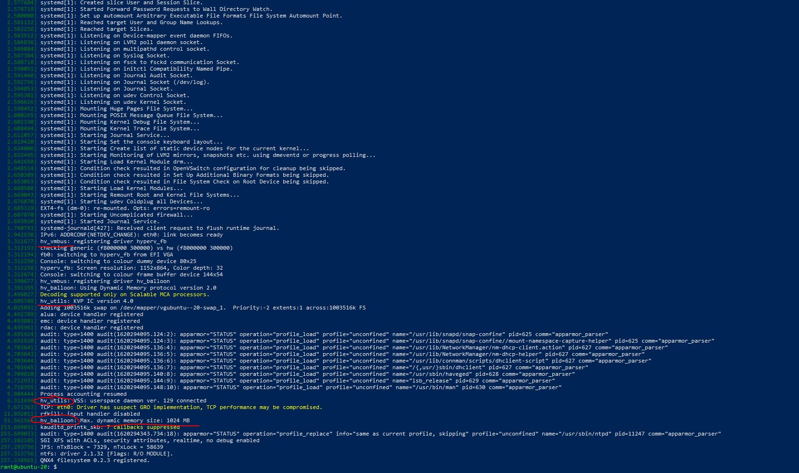

3. Netdata собирает такие метрики как     
    <li>cpu - Общая загрузка ЦП (все ядра). 100% здесь означает отсутствие простоя процессора.</li>
    <li>load - Текущая загрузка системы, то есть количество процессов, использующих ЦП или ожидающих системных ресурсов (обычно ЦП и диск).</li>
    <li>disk - Всего дисковых операций ввода-вывода для всех физических дисков.</li>
    <li>ram - Использование системной оперативной памяти (т.е. физической памяти).</li>
    <li>swap - Использование памяти подкачки системы.</li>
    <li>network - Общая пропускная способность всех физических сетевых интерфейсов, однако, здесь не учитываются VPN, сетевые мосты и т.п.</li>
    <li>processes - Системные процессы. Запущенные процессы в ЦП и заблокированые процессы.</li>
    <li>idlejitter</li>
    <li>interrupts - Общее количество прерываний ЦП.</li>
    <li>softirqs - анализируется для каждого ядра процессора.</li>
    <li>softnet - Статистика для CPU SoftIRQ, связанных с работой приема сети.</li>
    <li>entropy</li>
    <li>uptime</li>
    <li>ipc semaphores</li>
    <li>ipc shared memory</li>

4. Да, при помощи <code>dmesg</code> можно понять, что систему запущена на виртуальной машине, о чем будут свидетельствовать, например, такие сообщения: 

<code> hv_balloon: Max. dynamic memory size: 1024 MB</code>

