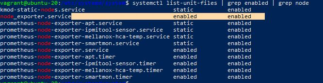

1. Установил node_exporter, добавил его в автозагрузку

2. То что выводится у меня в /metrics по умолчанию:
 

Я бы, наверно использовал: 

<li>node_cpu_seconds_total</li>
<li>node_pressure_cpu_waiting_seconds_total</li>
<li>node_memory_MemAvailable_bytes</li>
<li>node_memory_MemFree_bytes</li>
<li>node_memory_SwapCached_bytes</li>
<li>node_memory_SwapFree_bytes</li>
<li>node_disk_read_time_seconds_total</li>
<li>node_disk_write_time_seconds_total</li>
<li>node_disk_io_time_seconds_total</li>
<li>smartmon_device_active</li>
<li>node_network_receive_drop_total</li>
<li>node_network_receive_errs</li>
<li>node_network_up</li>

3. Netdata собирает такие метрики как     
    <li>cpu - Общая загрузка ЦП (все ядра). 100% здесь означает отсутствие простоя процессора.</li>
    <li>load - Текущая загрузка системы, то есть количество процессов, использующих ЦП или ожидающих системных ресурсов (обычно ЦП и диск).</li>
    <li>disk - Всего дисковых операций ввода-вывода для всех физических дисков.</li>
    <li>ram - Использование системной оперативной памяти (т.е. физической памяти).</li>
    <li>swap - Использование памяти подкачки системы.</li>
    <li>network - Общая пропускная способность всех физических сетевых интерфейсов, однако, здесь не учитываются VPN, сетевые мосты и т.п.</li>
    <li>processes - Системные процессы. Запущенные процессы в ЦП и заблокированые процессы.</li>
    <li>idlejitter</li>
    <li>interrupts - Общее количество прерываний ЦП.</li>
    <li>softirqs - анализируется для каждого ядра процессора.</li>
    <li>softnet - Статистика для CPU SoftIRQ, связанных с работой приема сети.</li>
    <li>entropy</li>
    <li>uptime</li>
    <li>ipc semaphores</li>
    <li>ipc shared memory</li>

4. Да, при помощи <code>dmesg</code> можно понять, что систему запущена на виртуальной машине, о чем будут свидетельствовать, например, такие сообщения: 

<code> hv_balloon: Max. dynamic memory size: 1024 MB</code>

5. По-умолчанию fs.nr_open настроен на открытие 1048576 файлов

<code>ulimit -n 165635</code> увеличивает это значение, но как я понял временно до перезагрузки

6. Сделал <code>unshare -f --pid --mount-proc sleep 1h</code>. Узнал его PID <code>ps auxf | grep sleep</code>. Зашел в этот аншеренный процесс <code>nsenter --target 70439 --pid --mount</code> (где 70439 это pid изолированного процесса). В нем уже сделал <code>ps aux</code>

7. <code>:(){ :|:&amp; };:</code> это форк бомба, которая вызывает bash, который вызывает себя и так далее. При вызове <code>dmesg</code> можно увидеть, что <code>cgroup</code> помог стабилизации системы

 чтобы изменить число процессов, которое можно создать в сессии надо изменить <code>DefaultTasksMax</code>

которое по-умолчанию у меня в системе равно 1035

