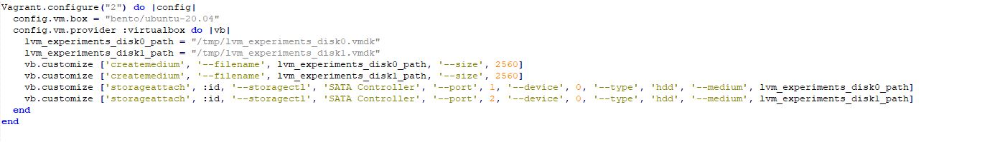
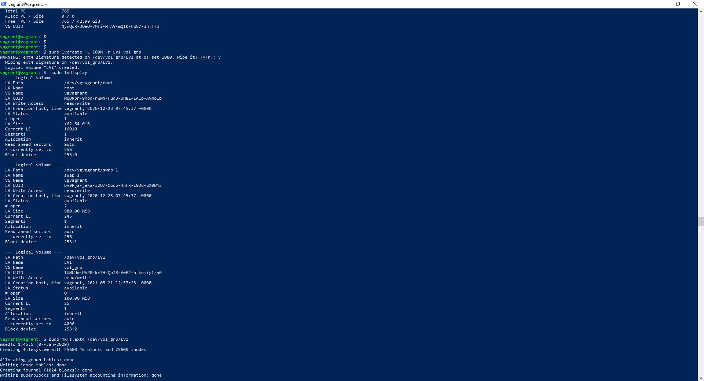
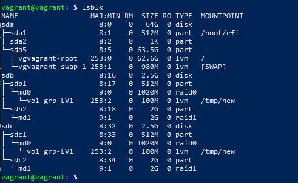
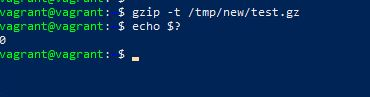
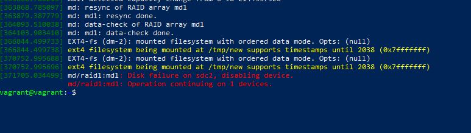
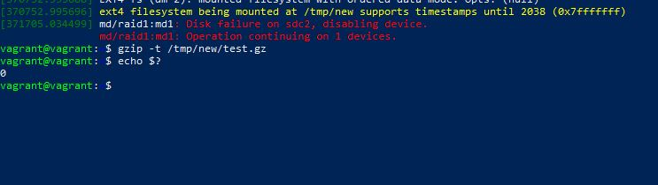

1. Sparse (разряженные) файлы -  файл, в котором последовательности нулевых байтов заменены на информацию об этих последовательностях (список дыр).

2. Файлы, которые являются жесткой ссылкой на один объект не могут иметь разные права доступа и владельца, потому что имеют одно значение inode. Различаются только имена файлов. Фактически жесткая ссылка это еще одно имя для файла.

3. 

10. Здесь я не очень понял, как LV, указав на PV с RAID0. Везде читал, что LV создается на группу.

14. 

15. 

18. 

19. 
