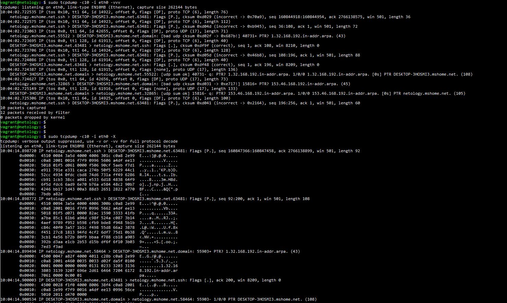

1. У меня не получилось отрыть через telnet адрес: <code>telnet towel.blinkenlights.nl</code>

2. В разделяемой среде WiFi при работе на 2.4 ГГц независимыми или непересекающимися являются только три канала: 1-й, 6-й и 11-й. В диапазоне 5ГГц - 23 неперекрывающихся канала

3. MAC-адрес <code>38:f9:d3:55:55:79</code> принадлежит устройству Apple.

4. <code>payload TCP=MTU–TCP–IP</code>, если MTU=9001 байт, а размер заголовков IPv4 – 20 байт, а TCP – 32 байта, то TCP Payload=9001-32-20=8949 байт.

5. Флаги SYN и FIN не могут быть установлены (это на мой взгляд), так как SYN устанавливается, при открытии соединения, а FIN при закрытии,что связано со спецификой TCP.

6. <code>UNCONN</code> статус характерен для UDP соединений, когда какой-либо сервис открыл порт 53 (DNS), если я правильно прочитал запрос. Для UDP не может быть статуса <code>TIME-WAIT</code>, так как это указывает, что локальная конечная точка (эта сторона) закрыла соединение, а так умеет только TCP, так как соединени не может быть закрыто сразу.

7. Процесс закрытия TCP соединения:
<table>
  <tbody>
    <tr>
      <th>A</th>
      <th>B</th>
     </tr>
    <tr>
      <td>(1) отправка FIN => </td>
      <td>FIN получен</td>
    </tr>
    <tr>
      <td>ACK получен</td>
      <td> <= отправка ACK (2)</td>
    </tr>
    <tr>
      <td>FIN получен</td>
      <td><= отправка FIN (3)</td>
    </tr>
    <tr>
      <td>(4) отправка ACK =></td>
      <td>ACK получен</td>
    </tr>
  </tbody>
</table>

8. 65535 (это максимальное число соединений для TCP) число соединений будет как с одного которое параллельно может установить клиент с одного IP адреса к серверу с одним IP адресом, так и для сервера. На сервере этот параметр ограничен еще максимальным количеством дескрипторов (любой сокет это дескриптор)

9. <code>TIME-WAIT</code> говорит о том, что TCP соединение на сервере закрыто другой стороны ожидается FIN от последнего отправленного АСК. Это ни хорошо, ни плохо. Плохо только тем, что чем долше происходит закрытие соединения, тем дольше остается занятым файловый дескриптор, а файловые дескрипторы могу заканчиваться.

10. UDP протокол передает данные без установки соединения, не подтверждает доставку и не делает повторы, в случае, неподной передачи данных. TCP устанавливает соединение, подтверждает доставку данных и в случае потери данных делает повторы, гарантирует целостность и правильную последовательность загружаемых данных.

11. Поэтому для передачи текстов лучше использовать TCP протокол. Но syslog работает через UDP, однако, в RFC 5424 есть рекомендация использовать протокол UDP TLS, где TLS на своем уровне устанавливает и закрывает соединение в пределах одной сессии.

12. На моей машине открыто 7 портов TCP: nginx, dns, ssh, сервер печати:

13. <code>sudo tcpdump -c10 -i eth0 -vvv</code>, если я правильно понял, vvv - увеличить количество показываемой информации и пакетов.

<code>sudo tcpdump -c10 -i eth0 -X</code>, X — показывает содержимое пакета в текстовом и шестнадцатеричном форматах.

14. Я сделал tcpdump <code>sudo tcpdump -c100 -i eth0 -vv -w file-0.pcap</code>, открыл полученный дамп <code>tshark -r file.pcap -V | more</code>
 
<pre><code>Frame 1: 90 bytes on wire (720 bits), 90 bytes captured (720 bits)
    Encapsulation type: Ethernet (1)
    Arrival Time: Jun  2, 2021 10:17:30.159732000 UTC
    [Time shift for this packet: 0.000000000 seconds]
    Epoch Time: 1622629050.159732000 seconds
    [Time delta from previous captured frame: 0.000000000 seconds]
    [Time delta from previous displayed frame: 0.000000000 seconds]
    [Time since reference or first frame: 0.000000000 seconds]
    Frame Number: 1
    Frame Length: 90 bytes (720 bits)
    Capture Length: 90 bytes (720 bits)
    [Frame is marked: False]
    [Frame is ignored: False]
    [Protocols in frame: eth:ethertype:ip:tcp:ssh]
Ethernet II, Src: Microsof_4c:f3:00 (00:15:5d:4c:f3:00), Dst: Microsof_63:f5:d8 (00:15:5d:63:f5:d8)
    Destination: Microsof_63:f5:d8 (00:15:5d:63:f5:d8)
        Address: Microsof_63:f5:d8 (00:15:5d:63:f5:d8)
        .... ..0. .... .... .... .... = LG bit: Globally unique address (factory default)
        .... ...0 .... .... .... .... = IG bit: Individual address (unicast)
    Source: Microsof_4c:f3:00 (00:15:5d:4c:f3:00)
        Address: Microsof_4c:f3:00 (00:15:5d:4c:f3:00)
        .... ..0. .... .... .... .... = LG bit: Globally unique address (factory default)
        .... ...0 .... .... .... .... = IG bit: Individual address (unicast)
    Type: IPv4 (0x0800)
Internet Protocol Version 4, Src: 192.168.46.153, Dst: 192.168.32.1
    0100 .... = Version: 4
    .... 0101 = Header Length: 20 bytes (5)
    Differentiated Services Field: 0x10 (DSCP: Unknown, ECN: Not-ECT)
        0001 00.. = Differentiated Services Codepoint: Unknown (4)
        .... ..00 = Explicit Congestion Notification: Not ECN-Capable Transport (0)
    Total Length: 76
    Identification: 0x3b31 (15153)
    Flags: 0x4000, Don't fragment
        0... .... .... .... = Reserved bit: Not set
        .1.. .... .... .... = Don't fragment: Set
        ..0. .... .... .... = More fragments: Not set
    Fragment offset: 0
    Time to live: 64
    Protocol: TCP (6)
    Header checksum: 0x2f80 [validation disabled]
    [Header checksum status: Unverified]
    Source: 192.168.46.153
    Destination: 192.168.32.1
Transmission Control Protocol, Src Port: 22, Dst Port: 63481, Seq: 1, Ack: 1, Len: 36
    Source Port: 22
    Destination Port: 63481
    [Stream index: 0]
    [TCP Segment Len: 36]
    Sequence number: 1    (relative sequence number)
    Sequence number (raw): 160868402
    [Next sequence number: 37    (relative sequence number)]
    Acknowledgment number: 1    (relative ack number)
    Acknowledgment number (raw): 2766144523
    0101 .... = Header Length: 20 bytes (5)
    Flags: 0x018 (PSH, ACK)
        000. .... .... = Reserved: Not set
        ...0 .... .... = Nonce: Not set
        .... 0... .... = Congestion Window Reduced (CWR): Not set
        .... .0.. .... = ECN-Echo: Not set
        .... ..0. .... = Urgent: Not set
        .... ...1 .... = Acknowledgment: Set
        .... .... 1... = Push: Set
        .... .... .0.. = Reset: Not set
        .... .... ..0. = Syn: Not set
        .... .... ...0 = Fin: Not set
        [TCP Flags: ·······AP···]
    Window size value: 501
    [Calculated window size: 501]
    [Window size scaling factor: -1 (unknown)]
    Checksum: 0xd029 [unverified]
    [Checksum Status: Unverified]
    Urgent pointer: 0
    [SEQ/ACK analysis]
        [Bytes in flight: 36]
        [Bytes sent since last PSH flag: 36]
    [Timestamps]
        [Time since first frame in this TCP stream: 0.000000000 seconds]
        [Time since previous frame in this TCP stream: 0.000000000 seconds]
    TCP payload (36 bytes)
SSH Protocol
    Packet Length (encrypted): 175bf26f
    Encrypted Packet: 00d4c81daabc252a9533ce8295cb85e1eb322293cbbedf1d…
    [Direction: server-to-client]</code></pre>

В данном дампе присутствует IP флаг Don't fragment, который указывает, что фрагментация пакета не допустима: 

<pre><code>Flags: 0x4000, Don't fragment
        0... .... .... .... = Reserved bit: Not set
        .1.. .... .... .... = Don't fragment: Set
        ..0. .... .... .... = More fragments: Not set</code></pre>

Флаг "More fragments" является одиночным битом в поле Флагов, используемым со Смещением Фрагмента для фрагментации и реконструкции пакетов. Когда флаг "Дополнительные Фрагменты" устанавливается, это означает, что это не последний фрагмент пакета.

Стандарт Ethernet, фреймы которого попали в дамп, называется Ethernet II

<code>Ethernet II, Src: Microsof_4c:f3:00 (00:15:5d:4c:f3:00), Dst: Microsof_63:f5:d8 (00:15:5d:63:f5:d8)</code> содержить OUI
