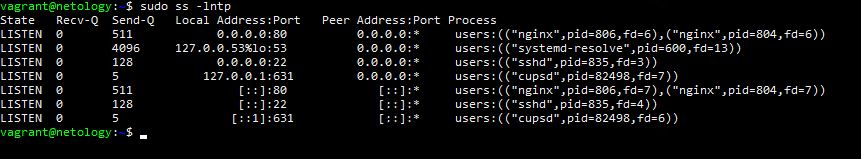

1. У меня не получилось отрыть через telnet адрес: <code>telnet towel.blinkenlights.nl</code>

2. В разделяемой среде WiFi при работе на 2.4 ГГц независимыми или непересекающимися являются только три канала: 1-й, 6-й и 11-й. В диапазоне 5ГГц - 23 неперекрывающихся канала

3. MAC-адрес <code>38:f9:d3:55:55:79</code> принадлежит устройству Apple.

4. <code>payload TCP=MTU–TCP–IP</code>, если MTU=9001 байт, а размер заголовков IPv4 – 20 байт, а TCP – 32 байта, то TCP Payload=9001-32-20=8949 байт.

5. Флаги SYN и FIN не могут быть установлены (это на мой взгляд), так как SYN устанавливается, при открытии соединения, а FIN при закрытии,что связано со спецификой TCP.

6. <code>UNCONN</code> статус характерен для UDP соединений, когда какой-либо сервис открыл порт 53 (DNS), если я правильно прочитал запрос. Для UDP не может быть статуса <code>TIME-WAIT</code>, так как это указывает, что локальная конечная точка (эта сторона) закрыла соединение, а так умеет только TCP, так как соединени не может быть закрыто сразу.

7. Процесс закрытия TCP соединения:
<table>
  <tbody>
    <tr>
      <th>A</th>
      <th>B</th>
     </tr>
    <tr>
      <td>(1) отправка FIN => </td>
      <td>FIN получен</td>
    </tr>
    <tr>
      <td>ACK получен</td>
      <td> <= отправка ACK (2)</td>
    </tr>
    <tr>
      <td>FIN получен</td>
      <td><= отправка FIN (3)</td>
    </tr>
    <tr>
      <td>(4) отправка ACK =></td>
      <td>ACK получен</td>
    </tr>
  </tbody>
</table>

8. 65535 (это максимальное число соединений для TCP) число соединений будет как с одного которое параллельно может установить клиент с одного IP адреса к серверу с одним IP адресом, так и для сервера. На сервере этот параметр ограничен еще максимальным количеством дескрипторов (любой сокет это дескриптор)

9. <code>TIME-WAIT</code> говорит о том, что TCP соединение на сервере закрыто другой стороны ожидается FIN от последнего отправленного АСК. Это ни хорошо, ни плохо. Плохо только тем, что чем долше происходит закрытие соединения, тем дольше остается занятым файловый дескриптор, а файловые дескрипторы могу заканчиваться.

10. UDP протокол передает данные без установки соединения, не подтверждает доставку и не делает повторы, в случае, неподной передачи данных. TCP устанавливает соединение, подтверждает доставку данных и в случае потери данных делает повторы, гарантирует целостность и правильную последовательность загружаемых данных.

11. Поэтому для передачи текстов лучше использовать TCP протокол. Но syslog работает через UDP, однако, в RFC 5424 есть рекомендация использовать протокол UDP TLS, где TLS на своем уровне устанавливает и закрывает соединение в пределах одной сессии.

12. На моей машине открыто 7 портов TCP: nginx, dns, ssh, сервер печати:

13. 
