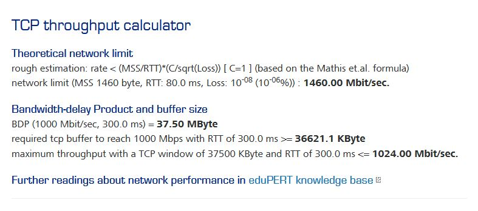
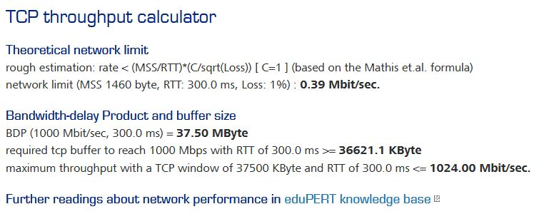
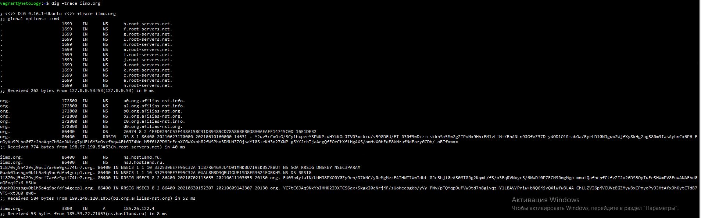

1. Исходя из формулы: <i>Ширина канала <= RWIN/RTT</i>, Получам (1000000000 бит/с *0,3с)/8=37500Кб должен быть размер окна, чтобы использовать максимально канал в 1Гбит/сек

2. При потере 1% пакетов ширина канала уменьшится в <code>(1500-20-20)/300√1%=4.9/100=0.049</code>раз

Если использовать калькулятор, то получается ограничение сети 0,39 Мбит/сек при 1% потере пакетов, при стандартном значении - 1460 Мбит/сек, то есть, если я правильно понял, 0,39 - это максимально возможная скорость TCP. То есть, пропускная способность упадет в 3743,59 раза.

Значение по-умолчанию:

Значение с 1% ошибок

3. При линке 100 Мбит/с реальная скорость будет сосотавлять около 11,86 Мбайт/с, Max TCP Payload= (MTU–TCP–IP) / (MTU+Ethernet+IFG) = (1500–40) / (1500+26+12) = 94.9 %. Размер фрейма будет влиять на скорость.

4. Когда открывается сайт происходит следующее:

<li>проверка списка предзагруженных HSTS, если он уже есть, то отправляется запрос через https, если его нет, то сначала отправляется запрос по http, и если сайт использует политику HSTS, то будет отправлен запрос, чтобы к нему врпедь обращались по https.</li>
<li>проверяется наличие доменного имени в кэше DNS, если его там нет, то проверяется наличие имени в файле /etc/hosts. Если его и там нет, то запускается фуекция gethostbyname, которая отправляет запрос к DNS-серверу, который указан в настройках сетевого интерфейса. Если DNS находится в тоже подсети, то отправляется ARP-запрос к этому серверу, если он находится в другой подсети, то ARP-запрос отправляется на IP адрес шлюза.</li>
<li>для начала проверяется кэш ARP, если в кэше нет записи, то проверяется таблица маршрутизации есть ли искомый IP-адрес в какой-либо из подсетей локальной таблицы. Если он там, то запрос посылается с помощью интерфейса, связанного с этой подсетью. Если адрес в таблице не обнаружен, то используется интерфейс подсети шлюза по умолчанию. Определяется MAC-адрес выбранного сетевого интерфейса. Отправляется ARP-запрос.</li>
<li>когда браузер получает IP-адрес конечного сервера, то он берёт эту информацию и данные об используемом порте из URL (80 порт для HTTP, 443 для HTTPS) и осуществляет вызов функции socket системной библиотеки и запрашивает поток TCP сокета — AF_INET и SOCK_STREAM. Этот запрос сначала проходит через транспортный уровень, где собирается TCP-сегмент. В заголовок добавляется порт назначения, исходный порт выбирается из динамического пула. Получившийся сегмент отправляется на сетевой уровень, на котором добавляется дополнительный IP-заголовок. Также включаются IP-адрес сервера назначения и адрес текущей машины. Пакет передаётся на канальный уровень. Добавляется заголовок кадра, включающий MAC-адрес сетевой карты (NIC) компьютера, а также MAC-адрес шлюза (локального роутера). Как и на предыдущих этапах, если ядру ничего не известно о MAC-адресе шлюза, то для его нахождения отправляется широковещательный ARP-запрос.</li>

5. У меня получилось 4 запроса:

6. В подсети <code>/25</code> будет <code>2^7-2=126</code>

Для начала переведем маску <code>255.248.0.0</code> в двоичный формат <code>11111111.11111000.00000000.0000000</code>, получается <code>/13</code> подсеть, а это <code>2^19-2=524286 адресов.</code>

7. В <code>/23</code> подсети адресов больше, чем в <code>/24</code>

8. <code>10.0.0.0/8</code>можно разделить на 128 подсетей. Маска подсети у таких подсетей будет <code>255.254.0.0
</code>

