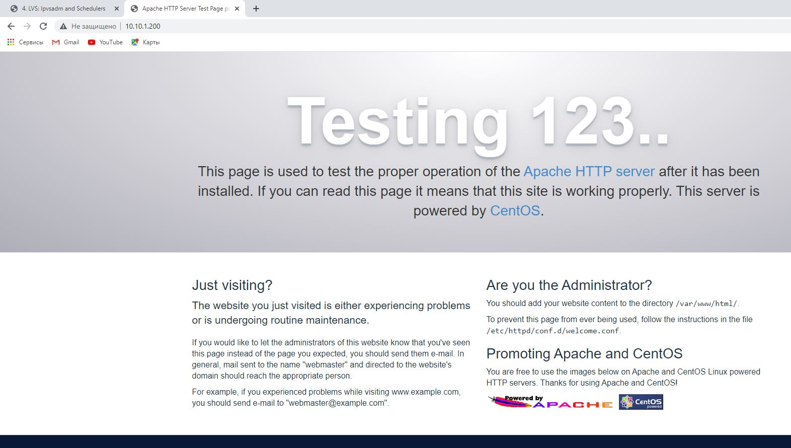

1. Такие службы, как http (в непостоянном режиме, например, HTTP /1.0) или ftp-data (порт 20), закрывают соединения, как только получено обращение / данные (html-страница, gif и т. Д.) (<1 сек). С LVS-сервисами мы будем видеть запись в столбце InActConn до тех пор, пока не истечет время ожидания соединения. Если мы получаем 1000 подключений в секунду и для тайм-аута подключения требуется 60 секунд (обычный тайм-аут), тогда у нас будет 60 000 InActConns. Такое количество InActConn вполне нормально. При этом, каждая запись занимает 128 байт (300 000 записей - это около 40 МБ памяти, убедитесь, что у вас достаточно оперативной памяти для вашего приложения).

2. Я создал 3 виртуальные машины и присвоил виртуальный адрес для фермы VRRP.

<li>lab1 (10.10.1.103/24) - master</li>
<pre><code>global_defs {
router_id uMASTER
}

vrrp_instance VI_1 {
state MASTER
interface eth1
virtual_router_id 1
priority 255
virtual_ipaddress {
10.10.1.200/32 dev eth1 label eth1:1
}
}</code></pre>
<li>lab2 (10.10.1.100/24) - backup</li>
<pre><code>global_defs {
router_id uBACKUP
}

vrrp_instance VI_1 {
state BACKUP
interface eth1
virtual_router_id 1
priority 100
virtual_ipaddress {
10.10.1.200/32 dev eth1 label eth1:1
}
}</code></pre>
<li>lab3 (10.10.1.101/24) - apache</li>

 Так же на lab1 и lab2 настроил nginx, в качестве <a href="../03-sysadmin-08-net/files/nginx.conf">обратного прокси</a>

При остановке службы keepalived на мастере происходит переключение на backup сервер:

Сервер с apache остается доступным

