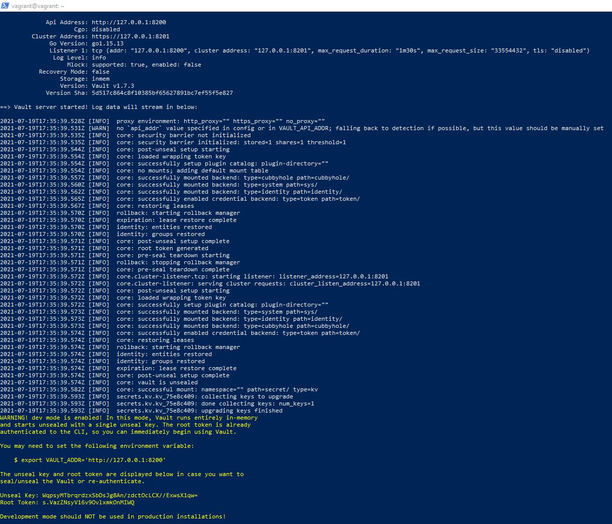
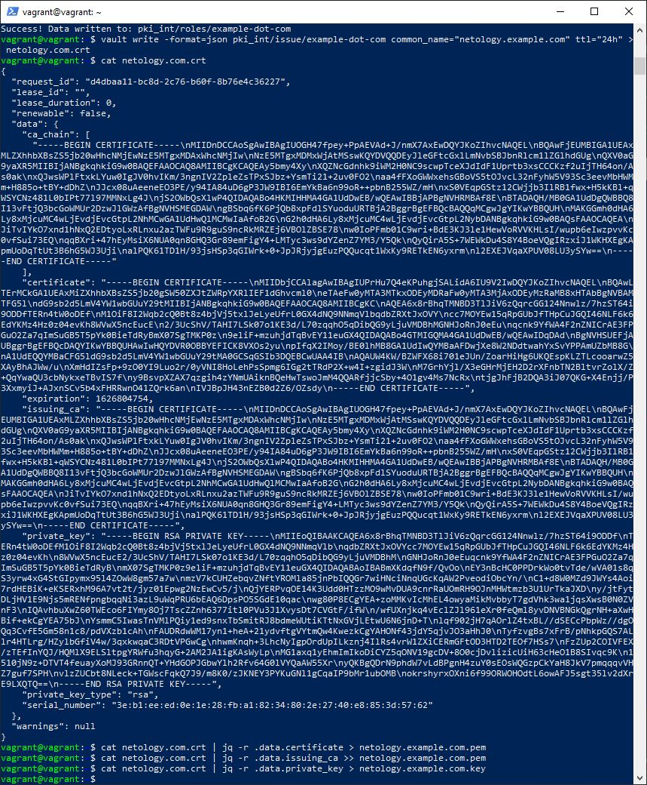
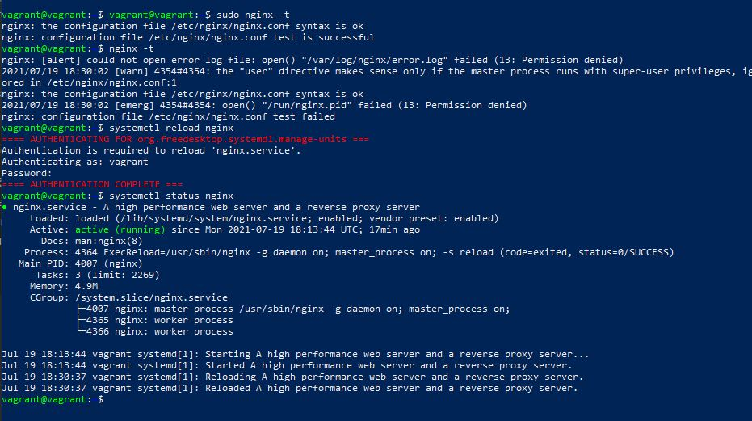

1. Добавил в Vagrantfile виртуальной машины конфиг <code>config.vm.network "forwarded_port", guest: 8200, host: 8200</code>

2. Vault-сервер в dev-режиме

Добавил переменную для взаимодействия с сервером и значение <code>VAULT_TOKEN</code>

3. Cоздал Root CA и Intermediate CA

а так же сертификаты для netology.example.com

5. Установил и настроил как службу nginx на работу с SSL сертификатами

Дальше не совсем понимаю, откуда взять сертификаты, чтобы подцепить их в nginx
