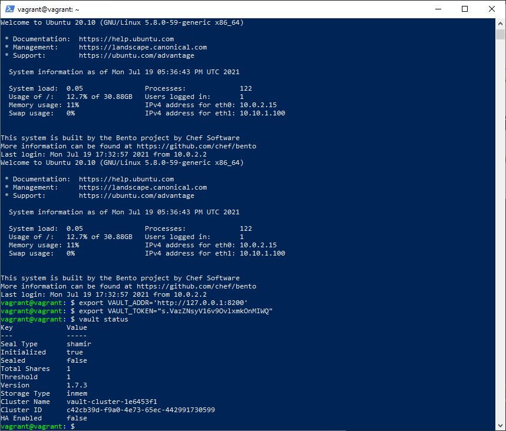

1. Добавил в Vagrantfile виртуальной машины конфиг <code>config.vm.network "forwarded_port", guest: 8200, host: 8200</code>

2. Vault-сервер в dev-режиме

Добавил переменную для взаимодействия с сервером и значение <code>VAULT_TOKEN</code>

3. Cоздал Root CA и Intermediate CA

