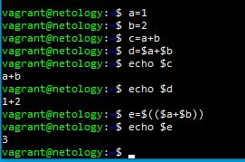

1. <em>с</em> будет равно <em>a+b</em>, так как не были задекларированы все переменные, поэтому отображаются как строки, <em>d</em> будет равно <em>1+2</em>, так как показывает значение a и b, <em>e</em> будет равно <em>3</em>

2. В скрипте: 
<pre><code>while ((1==1)  		# здесь не хватает второй скобки
    do
    curl https://localhost:4757
if (($? != 0))
then  			    #необходимо добавить break
    date >> curl.log    #чтобы не заканчивалось место, надо не добавить запись в конец лога, а внести новую
fi			
done</code></pre>

Чтобы он правильно отрабатывал, необходимо внести следующие правки:

<pre><code>while ((1==1))
    do
    curl https://localhost:4757
if (($? != 0))
then  			
    date > curl.log
else
    break
fi			
done</code></pre>

3. Скрипт, который проверяет доступность трёх IP: 192.168.0.1, 173.194.222.113, 87.250.250.242 по 80 порту и записывает результат в файл log:

<pre><code>#!/bin/bash
ip=(192.168.0.1 173.194.222.113 87.250.250.242)
for i in ${ip[@]}
do
x=0
while ((x!=5))
    do
    curl -I --connect-time 2 http://$i:80>/dev/null
       if (($? !=0))
          then
          let "x+=1"
          echo `date` " IP "$i" Not Avalible" >> log
          else
          echo `date` " IP "$i" Avalible" >> log
          let "x+=1"
       fi
done
done
</code></pre>

версия скрипта, где он выполнялся до тех пор, пока один из узлов не окажется недоступным и пишет ошибки в error-лог

<pre><code>#!/bin/bash
ip=(173.194.222.113 87.250.250.242 192.168.0.1)
while ((1==1))
do
for i in ${ip[@]}
do
sleep 2
curl -I --connect-time 2 http://$i:80>/dev/null
       if (($?!=0))
	  then
	  echo `date` " IP "$i" Not Avalible" >> error
	  break 2
       fi
done
done</code></pre>
