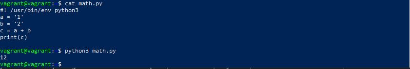

<p>1. Значение C будет ошибка:TypeError: unsupported operand type(s) for +: 'int' and 'str'. Нельзя складывать разные типы переменных строчки и числа.</p>

<p>Необходимо переменную A изменить на строковый тип str, тогда получим значение 12</p>

<p>Чтобы получить значение 3, необходимо переменную B изменить на числовой тип int</p>

<p>2.</p>

Результат корректировки скрипта:

```python
    #!/usr/bin/env python3
    
    import os
    
    bash_command = ["cd /home/vagrant/netology/sysadm-homeworks", "git status"]
    result_os = os.popen(' && '.join(bash_command)).read()
    for result in result_os.split('\n'):
        if result.find('modified') != -1:
            prepare_result = result.replace('\tmodified:   ', '')
            print(prepare_result)

Вывод скрипта:

    vagrant@vagrant:~/netology$ ./test.py ~/netology/sysadm-homeworks/
    123
    321
    qweqweq
```
<p>3. Доработал скрипт выше так, чтобы он мог проверять не только локальный репозиторий в текущей директории, а также умел воспринимать путь к репозиторию, который мы передаём как входной параметр.</p>

```python
    #!/usr/bin/env python3

    import os
    import sys

    path_repo = sys.argv[1]
    check_dir = os.path.exists(f'{path_repo}.git')
    if check_dir != True:
        print('Данная директория не является репозиторием')
        exit()
    bash_command = [f'cd {path_repo}', "git status"]
    result_os = os.popen(' && '.join(bash_command)).read()
    for result in result_os.split('\n'):
        if result.find('modified') != -1:
            prepare_result = result.replace('\tmodified:   ', '')
            print(prepare_result)
```

Вывод скрипта:

    vagrant@vagrant:~/netology$ ./test.py ~/netology/testing1
    fatal: not a git repository (or any of the parent directories): .git

    vagrant@vagrant:~/netology$ ./test.py ~/netology/sysadm-homeworks/
    123
    321
    qweqweq

