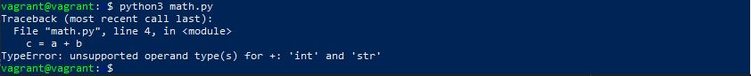
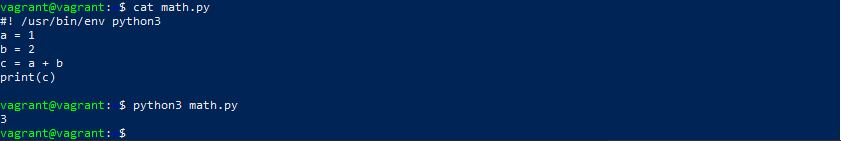

1. Значение C будет ошибка:TypeError: unsupported operand type(s) for +: 'int' and 'str'. Нельзя складывать разные типы переменных строчки и числа.

Необходимо переменную A изменить на строковый тип str, тогда получим значение 12

Чтобы получить значение 3, необходимо переменную B изменить на числовой тип int

2.

Результат корректировки скрипта:

    #!/usr/bin/env python3
    
    import os
    
    bash_command = ["cd /home/vagrant/netology/sysadm-homeworks", "git status"]
    result_os = os.popen(' && '.join(bash_command)).read()
    is_change = False
    for result in result_os.split('\n'):
        if result.find('modified') != -1:
            prepare_result = result.replace('\tmodified:   ', '')
            print(prepare_result)
            is_change = True
        if is_change == True :
            continue

Вывод скрипта:

    vagrant@vagrant:~/netology$ ./test.py ~/netology/sysadm-homeworks/
    123
    321
    qweqweq
