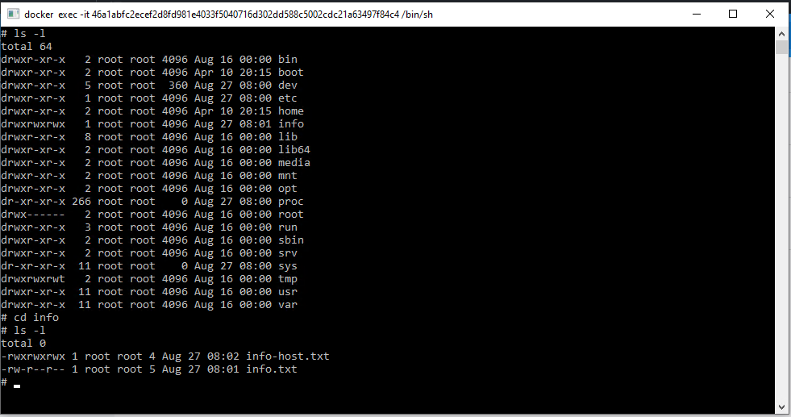
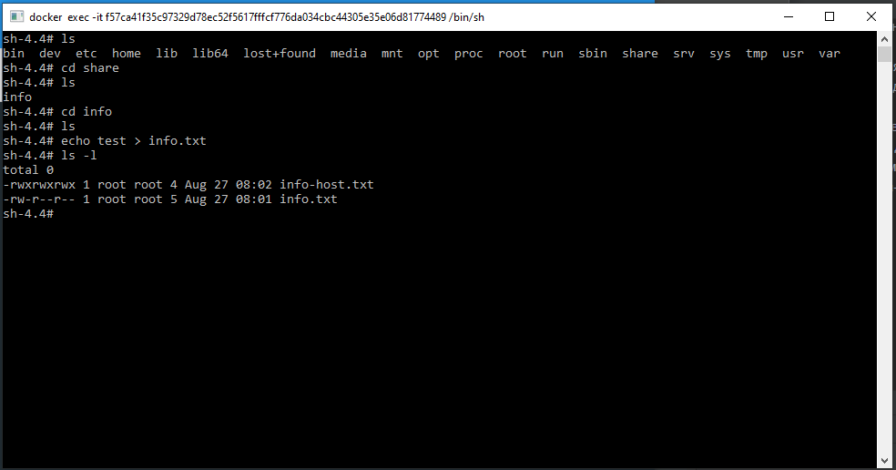
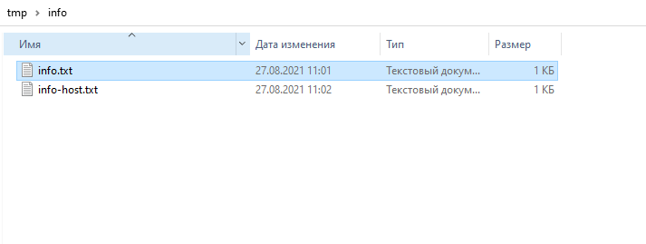

1. Сценарии использования docker:

- Высоконагруженное монолитное java веб-приложение: для него лучше использовать виртуальную или физическую машину, так как приложение высоконагруженное;
- Go-микросервис для генерации отчетов: лучше использовать docker, это микросервис;
- Nodejs веб-приложение: приложение статично, поэтому можно использовать docker
- Мобильное приложение c версиями для Android и iOS: если речь о backend, то лучше docker;
- База данных postgresql используемая, как кэш: все что изменяемо и чувствительно к производительности, а так же ценно, особенно БД, лучше использовать физическую машину, в крайнем случае виртуальную.
- Шина данных на базе Apache Kafka: лучше использовать виртуальную машину, хотя, наверно, можно скомбинировать VM+Docker;
- Очередь для Logstash на базе Redis: данные изменяемые и в случае падения контейнера можно часть потерять, думаю лучше использовать VM;
- Elastic stack для реализации логирования продуктивного веб-приложения - три ноды elasticsearch, два logstash и две ноды kibana: думаю все можно распихать по контейнерам;
- Mongodb, как основное хранилище данных для java-приложения: или физическую или виртуальную машину;
- Jenkins-сервер: можно использовать docker.

2. <a href="https://hub.docker.com/repository/docker/sakhnail/httpd">Ссылка</a> на опубликованный образ

3. Листинг на контейнере debian: 

 Файл info в контейнере centos:

Файлы на хостовой машине: 

