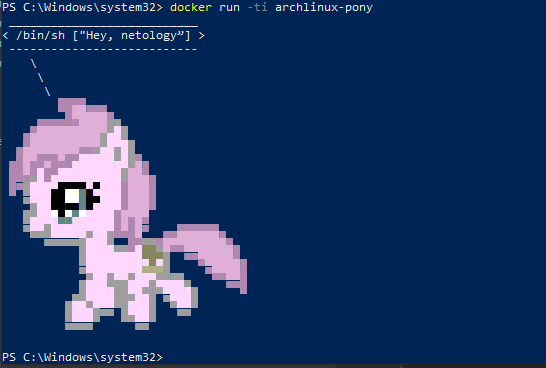
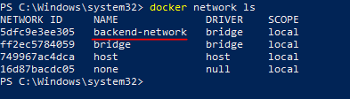

1. <a href="../05-virt-04-docker-practical-skills/files/Dockerfile">Dockerfile</a> 

<a href="https://hub.docker.com/repository/docker/sakhnail/ponysay">Ссылка</a> на репозиторий dockerhub

2. Amazoncorreto+Jenkins 
 

- <a href="../05-virt-04-docker-practical-skills/files/Dockerfile-amazoncorretto">Dockerfile</a>
- скриншот лога:

- скриншот веб-страницы:

- <a href="https://hub.docker.com/repository/docker/sakhnail/amazoncorreto-jenkins">Ссылка</a> на репозиторий с образом 

Ubuntu+Jenkins

- <a href="../05-virt-04-docker-practical-skills/files/Dockerfile-ubuntu">Dockerfile</a>
- скриншот лога:

- скриншот веб-страницы:

- <a href="https://hub.docker.com/repository/docker/sakhnail/ubuntu-jenkins">Ссылка</a> на репозиторий с образом

3. <a href="../05-virt-04-docker-practical-skills/files/Dockerfile-node">Dockerfile</a> с npm приложением

вывод <code>docker network ls</code>

скриншот вывода curl в ubuntu-контейнере

