1. Команда запуска контейнера
```shell
docker run --rm --name pg-docker -e POSTGRES_PASSWORD=postgres -e POSTGRES_USER=postgres -e POSTGRES_DB=pgtestdb -d -p 5432:5432 -v vol1:/var/lib/postgresql/data -v vol2:/var/lib/postgresql postgres:12
```
```shell
docker exec -it pg-docker psql -U postgres
```
2. Создал базу данных
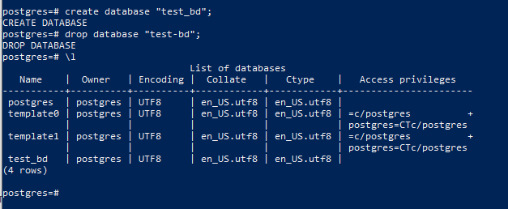

Создал пользователя test-admin-user

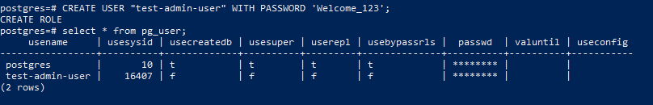

Назначил права на базу test-bd test-admin-user

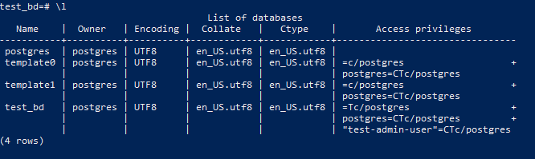

Список таблиц и прав на них

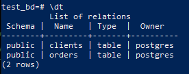
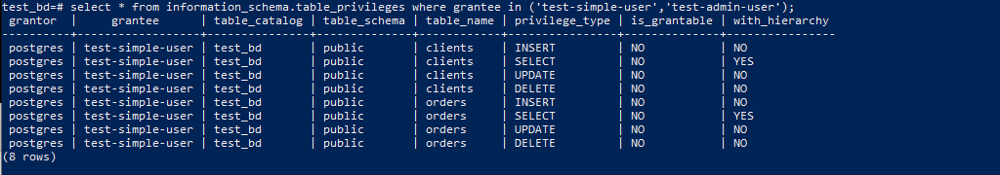

3. SQL-запросы:
```sql
INSERT INTO orders VALUES (1, 'Шоколад', 10), (2, 'Принтер', 3000), (3, 'Книга', 500), (4, 'Монитор', 7000), (5, 'Гитара', 4000); /* Таблица orders */
INSERT INTO clients VALUES (1, 'Иванов Иван Иванович', 'USA'), (2, 'Петров Петр Петрович', 'Canada'), (3, 'Иоганн Себастьян Бах', 'Japan')
, (4, 'Ронни Джеймс Дио', 'Russia'), (5, 'Ritchie Blackmore', 'Russia'); /* Таблица clients */
SELECT COUNT (*) FROM orders; /* количество записей */
SELECT COUNT (*) FROM clients; /* количество записей */
```
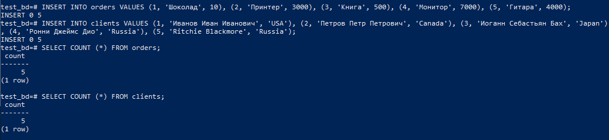
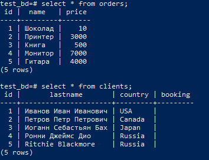
4. Обновил таблицу clients:
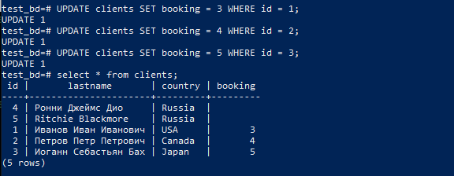

Запрос с выборкой без пустных заказов:

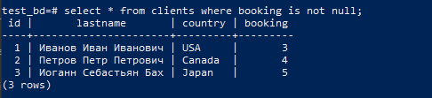

5. У меня получилось так: 
```python
test_bd=# EXPLAIN SELECT * FROM clients;
                        QUERY PLAN
-----------------------------------------------------------
 Seq Scan on clients  (cost=0.00..18.10 rows=810 width=72)
(1 row)
```
Затем я выполнил ANALYZE
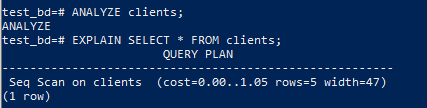

<p>и изменилось количество строк, их размер и, если это можно так назвать, время на выполнение запроса.</p>
<p>Почитал, что для реального отображения значений можно выполнять запрос</p>

```python
EXPLAIN (ANALYZE) SELECT * FROM clients;
```

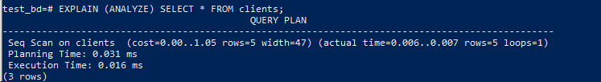

<p>в таком случае мы увидим:</p>
<p>actual time — реальное время в миллисекундах, затраченное для получения первой строки и всех строк соответственно.</p>
<p>rows — реальное количество строк, полученных при Seq Scan.</p>
<p>loops — сколько раз пришлось выполнить операцию Seq Scan.</p>
