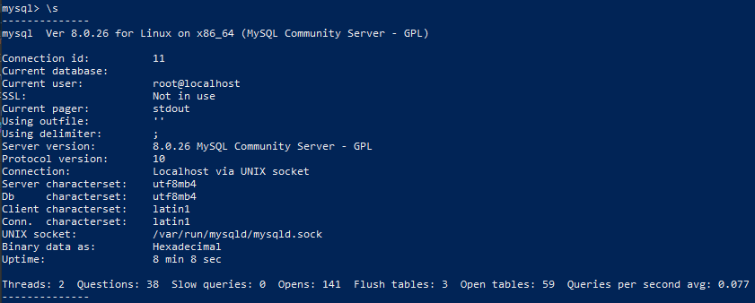
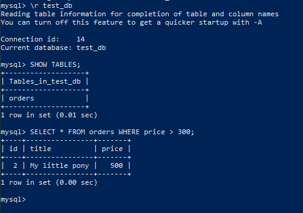
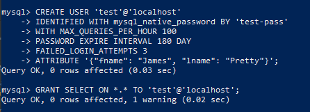
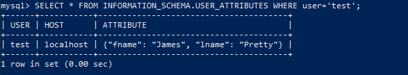

1. Запустил контейнер:
```shell
docker run --name mysql-docker -e MYSQL_ROOT_PASSWORD=mysql -ti -d -p 3306:3306 -v vol_mysql:/etc/mysql/ -v c:\tmp\mysql:/tmp/ mysql:8.0
```
Восстановил БД из дампа:
```shell
mysql -p test_db < /tmp/test_dump.sql
```
Получил статус БД: 



Выввел количество записей с price > 300



2. Создал пользователя test в БД c паролем test-pass





3. 