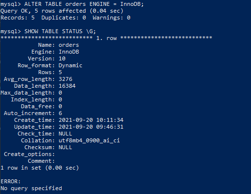

1. Запустил контейнер:
```shell
docker run --name mysql-docker -e MYSQL_ROOT_PASSWORD=mysql -ti -d -p 3306:3306 -v vol_mysql:/etc/mysql/ -v c:\tmp\mysql:/tmp/ mysql:8.0
```
Восстановил БД из дампа:
```shell
mysql -p test_db < /tmp/test_dump.sql
```
Получил статус БД: 


Выввел количество записей с price > 300


2. Создал пользователя test в БД c паролем test-pass


3. Установил профилирование SET profiling = 1


Информация об engine в таблице БД test_db


Изменил engine на MyISAM


Отображение профайлера:


Изменение движка на InnoDB



Отображание профайлера


4. Файл my.cnf
