1. Запустил контейнер с pg:
```shell
docker run --name pg-docker -e POSTGRES_PASSWORD=postgres -ti -d -p 5432:5432 -v vol_postgres:/var/lib/postgresql/data postgres:13
```
запустил psql

```shell
docker exec -it pg-docker psql -U postgres -W
```
список бд:


вывод списка таблиц в postgres и описания (я поставил на конце S, так как по \dt он мне не выдал список таблиц, видимо, потому что пользовательских таблиц нет)


выход из psql
```shell
postgres=# \q
```
2. Восстановил базу из дампа:
```shell
psql -U postgres -f /var/lib/postgresql/data/test_dump.sql test_database;
```
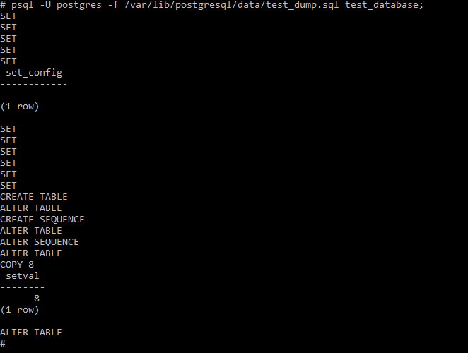

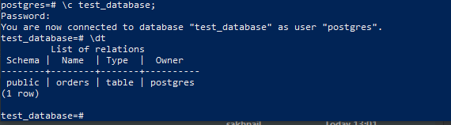

Вывод ANALYZE:

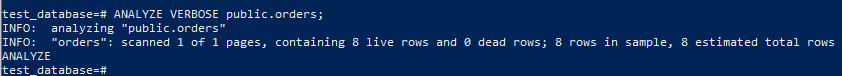

Столбец orders:

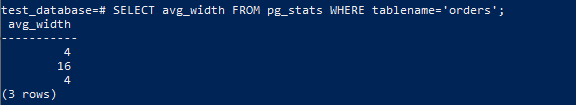

3. Обновил имя базы: 
```shell
 alter table orders rename to orders_ex;
```
Создал новые таблицы: 
сначала я хотел сделать так: 
```shell
 create table orders (like orders_ex including all) partition by range(price);
```
но получил ошибку:

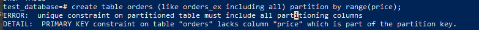

пришлось деать так: 

```shell
create table orders (id integer, title varchar(80), price integer) partition by range(price);
```
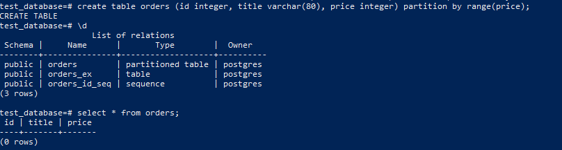

затем создал 2 партиции: 
правда, со второй ошибку допустил,
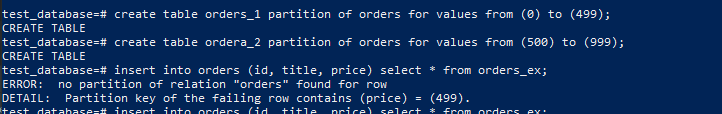

но потом поправил и зарузил данные в таблицу orders:

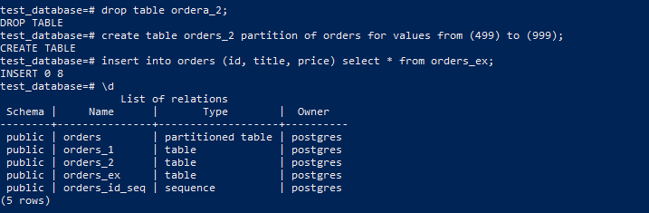

результат по таблицам orders_1 и orders_2

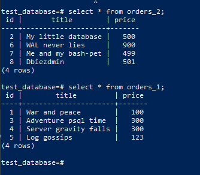

4. Создал [дамп](https://github.com/sakhnail/sysadm-homeworks/blob/main/06-db-04-postgresql/test_dump_210921.sql) бд test_database

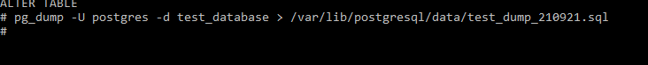

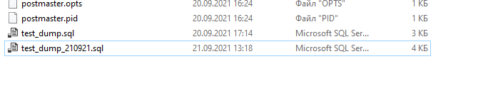

Добавил бы UNIQUE при создании таблицы

```shell
CREATE TABLE public.orders (
    id integer NOT NULL,
    title character varying(80) UNIQUE,
    price integer DEFAULT 0
);
```