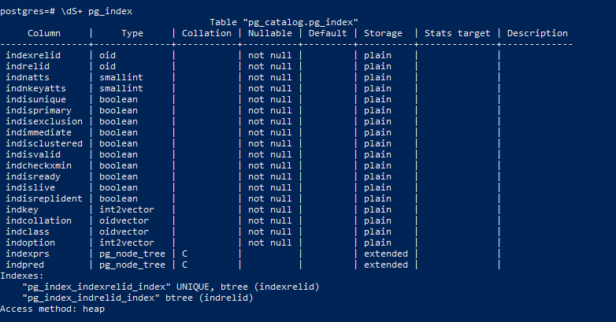

1. Запустил контейнер с pg:
```shell
docker run --name pg-docker -e POSTGRES_PASSWORD=postgres -ti -d -p 5432:5432 -v vol_postgres:/var/lib/postgresql/data postgres:13
```
запустил psql

```shell
docker exec -it pg-docker psql -U postgres -W
```
список бд:


вывод списка таблиц в postgres и описания (я поставил на конце S, так как по \dt он мне не выдал список таблиц, видимо, потому что пользовательских таблиц нет)




выход из psql
```shell
postgres=# \q
```
2.