1. Собрал образ ES

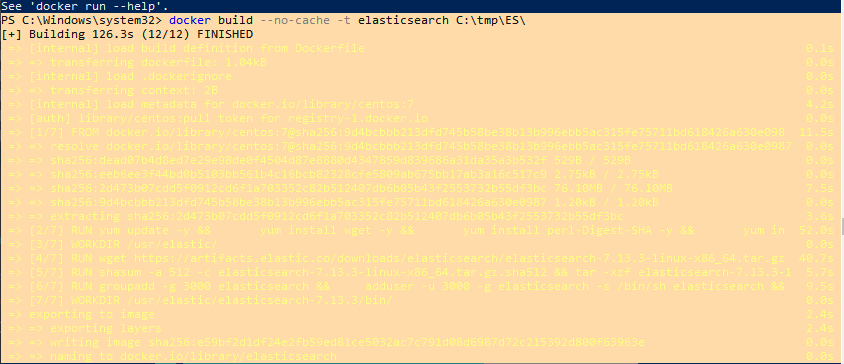

[Dockerfile](https://github.com/sakhnail/sysadm-homeworks/blob/main/06-db-05-elasticsearch/Dockerfile)

запустил контейнер

```shell
docker run -p 9200:9200 --name es-home --memory="1g" -d elasticsearch
```
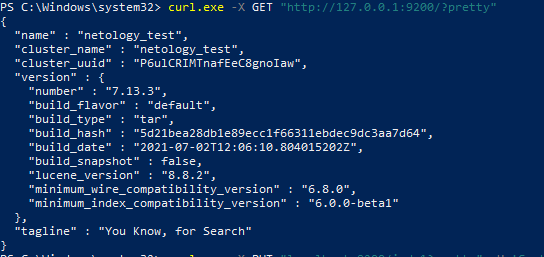

[Ссылка](https://hub.docker.com/repository/docker/sakhnail/elastic) на репозиторий с образом

2. Список индексов и статус

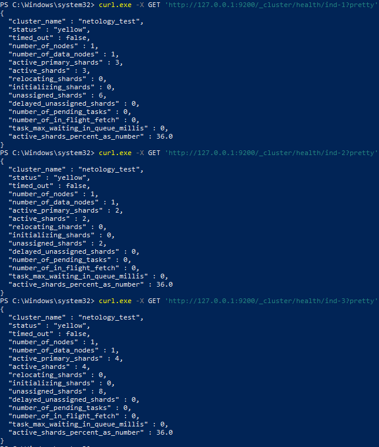

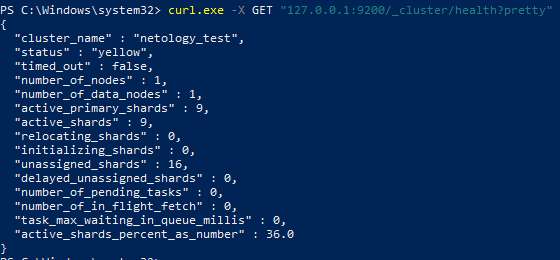

Статус <code>Yellow</code> потому что указано количество реплик, а так как это кластер, но с одним сервером, реплики невозможно создать, я так думаю.

Удаление индексов:

```shell
curl.exe -X DELETE "127.0.0.1:9200/ind-1?pretty" {/"acknowledged/" : true}
curl.exe -X DELETE "127.0.0.1:9200/ind-2?pretty" {/"acknowledged/" : true}
curl.exe -X DELETE "127.0.0.1:9200/ind-3?pretty" {/"acknowledged/" : true}
```

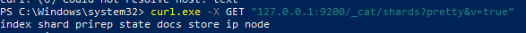

3. Создал каталог в snapshots в корневой директории ES.

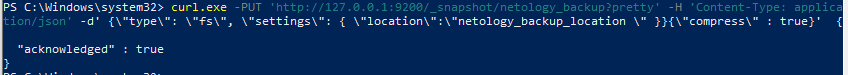

Зарегистрировал репозиторий
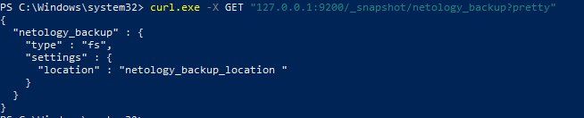

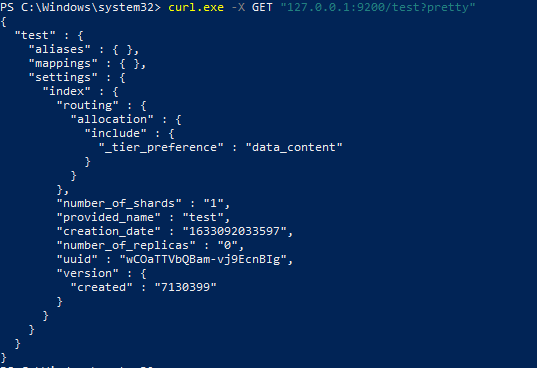

Создал индекс test реплика 0, шард 1:

```shell
curl.exe -X PUT "127.0.0.1:9200/test?pretty" -H 'Content-Type: application/json' -d'
>> {
>> "settings":{
>> "number_of_shards": 1,
>> "number_of_replicas": 0
>> }
>> }
>> ' {\"acknowledged\" : true, \"shards_acknowledged\" : true, \"index\" : "test"}
```
Сделал снапшот: 

```shell
curl.exe -X PUT "127.0.0.1:9200/_snapshot/netology_backup/snapshot_test?wait_for_completion=true&pretty" {\"snapshot\" : {\"snapshot\" : "snapshot_test", \"uuid\" : "LvR3VmNES2CVUii8eAPi7Q", \"version_id\" : 7130399, \"version\" : "7.13.3", \"indices\" : ["test"], \"data_streams\" : [ ], \"include_global_state\" : true, \"state\" : "SUCCESS",\"start_time\" : "2021-10-03T13:09:57.575Z",\"start_time_in_millis\" : 1626613797575,\"end_time\" : "2021-10-03T13:09:57.575Z",\"end_time_in_millis\" : 1626613797575,\"duration_in_millis\" : 0,\"failures\" : [ ],\"shards\" : {\"total\" : 1,\"failed\" : 0,\"successful\" : 1},\"feature_states\" : [ ]}}
```

Список снапшотов:

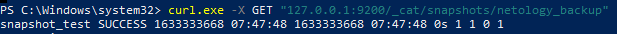

Удаление индекса test

```shell
curl.exe -X DELETE "127.0.0.1:9200/test?pretty" {\"acknowledged\" : true}
```

Создание индекса test-2

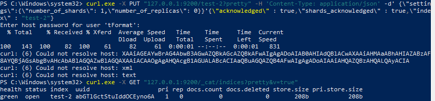

Восстановление снапшота
```shell
curl.exe -X POST "127.0.0.1:9200/_snapshot/netology_backup/snapshot_test/_restore?pretty"{\"accepted\" : true}
```
Список индексов после восстановления

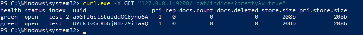

**Если честно, это самая непонятная для меня тема, я все делал по инструкциям и не знаю. на сколько правильно делал. 