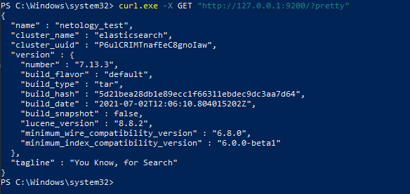

1. Собрал образ ES


[Dockerfile](https://github.com/sakhnail/sysadm-homeworks/blob/main/06-db-05-elasticsearch/Dockerfile)

запустил контейнер

```shell
docker run -p 9200:9200 --name es-home --memory="1g" -d elasticsearch
```


[Ссылка](https://hub.docker.com/repository/docker/sakhnail/elasticsearch) на репозиторий с образом

2. 