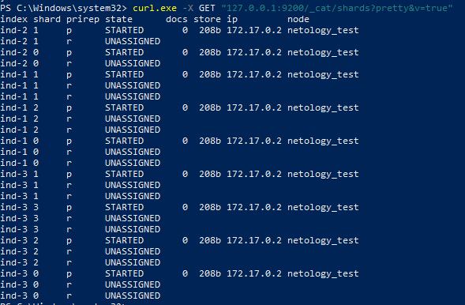

1. Собрал образ ES


[Dockerfile](https://github.com/sakhnail/sysadm-homeworks/blob/main/06-db-05-elasticsearch/Dockerfile)

запустил контейнер

```shell
docker run -p 9200:9200 --name es-home --memory="1g" -d elasticsearch
```


[Ссылка](https://hub.docker.com/repository/docker/sakhnail/elastic) на репозиторий с образом

2. Список индексов и статус




Статус <code>Yellow</code> потому что указано количество реплик, а так как это кластер, но с одним сервером, реплики невозможно создать, я так думаю.
