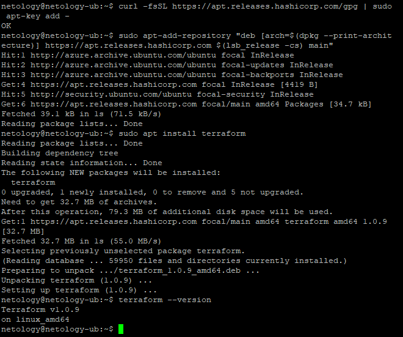
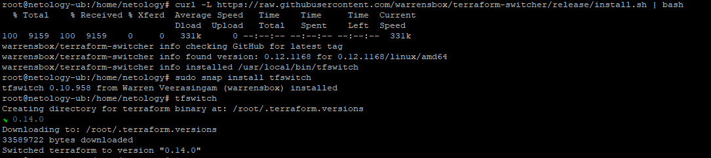

1. Легенда

1.1. Ответы: 
* Какой тип инфраструктуры будем использовать для этого проекта: изменяемый или не изменяемый?
<p>Наверно, изменяемый, так как будет много правок и изменений. </p>

* Будет ли центральный сервер для управления инфраструктурой?
<p>Думаю, что не будет, так как все можно развернуть с помощью инструментов без отдельного сервера</p>

* Будут ли агенты на серверах?

<p>Если сервера не будет, то не будет.</p>

* Будут ли использованы средства для управления конфигурацией или инициализации ресурсов?

<p>да, при использовании изменяемой и неизменяемой инфраструктуры, с учетом частых обновлений и последующего расширения
  логично использовать оба средства и для управления конфигурацией и для инициализации ресурсов</p>

1.2. Инструменты для нового проекта: так как Terraform начал использоваться в предприятии, то, предположительно, это является целевым инструментом, значит Terraform будет использоваться для инициализации ресурсов, так же по причине использования внешних ресурсов, в том числе для управления конфигурацией Ansible. Так же потому что есть на предприятии, и с учетом ответов на предыдущие вопросы.

1.3. Так как система не отлажена, и конечный ее вид не известен, то имеющихся инструментов достаточно

2. Установил terraform:



3. Установил tfswitch

```shell
curl -L https://raw.githubusercontent.com/warrensbox/terraform-switcher/release/install.sh | bash
```
```shell
 sudo snap install tfswitch
```
