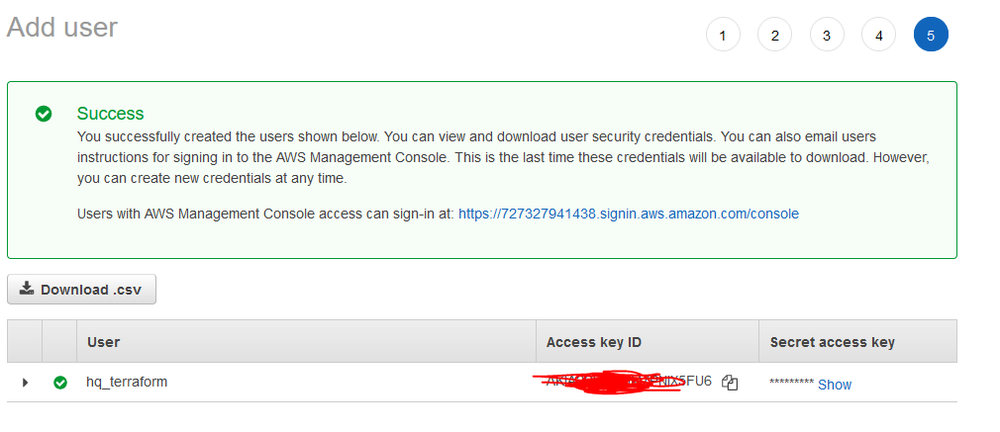

1. Создал нового пользователя в IAM:



Настроил конфиг terraforms, инициализировал его <code>terraform init </code>, и создал инстанс <code> terraform plan</code>: 

```shell
provider "aws" {
access_key = "AKI***AM6"
secret_key = "b3PM7UPX6***B88m"
region = "eu-central-1"
}

resource "aws_instance" "instance1" {
ami = "ami-0a49b025fffbbdac6"
instance_type = "t2.micro"
tags = {
Name = "netology_test"
}
}

```
Удалил инстранс <code>terraform destroy </code>:

```shell
aws_instance.instance1: Destroying... [id=i-011250ca3ff91104d]
aws_instance.instance1: Still destroying... [id=i-011250ca3ff91104d, 10s elapsed]
aws_instance.instance1: Still destroying... [id=i-011250ca3ff91104d, 20s elapsed]
aws_instance.instance1: Destruction complete after 30s
```
Вывод <code>aws configure list</code>

```shell
[cloudshell-user@ip-10-0-102-250 ~]$ aws configure list
      Name                    Value             Type    Location
      ----                    -----             ----    --------
   profile                <not set>             None    None
access_key     ****************KXV6   container-role    
secret_key     ****************vVTZ   container-role    
    region             eu-central-1              env    ['AWS_REGION', 'AWS_DEFAULT_REGION']
```
2. 