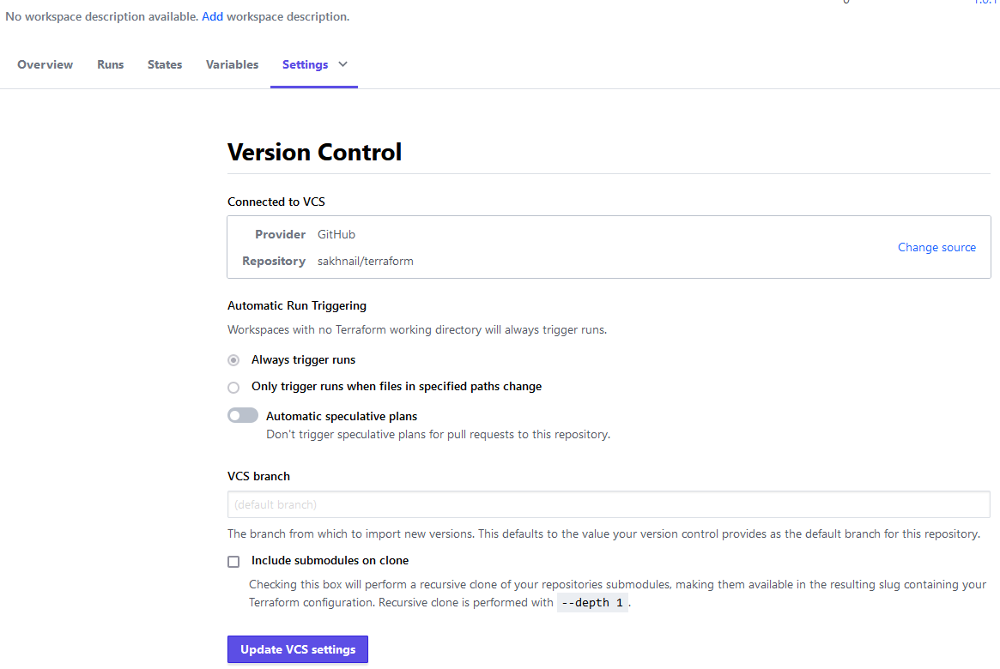
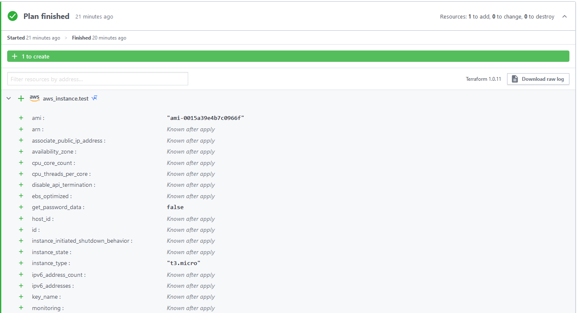
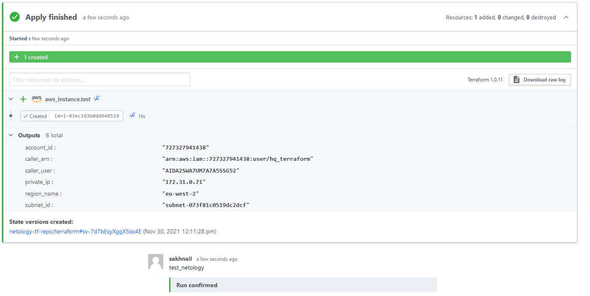
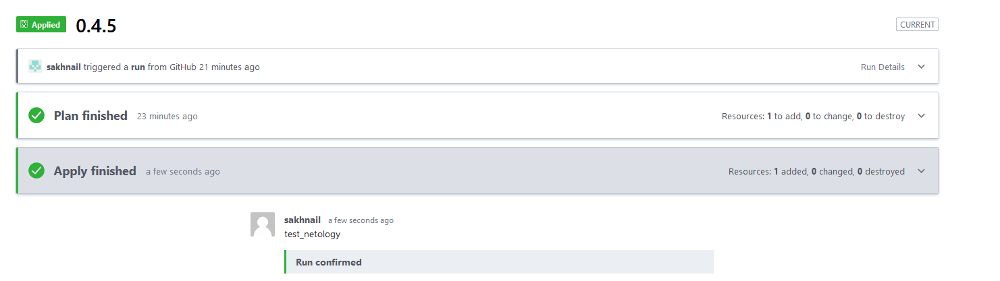
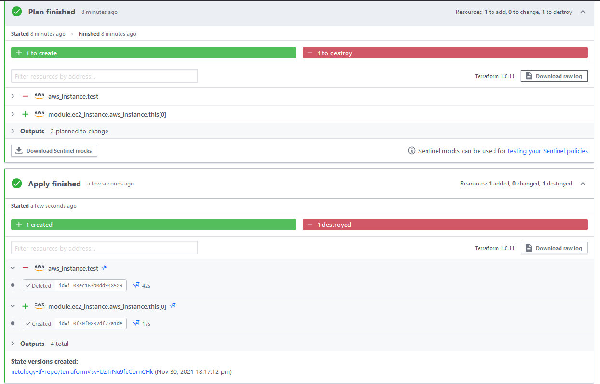

1. Зарегистрировал аккаунт и репозиторий на https://app.terraform.io/

Добавил свой репозиторий GitHub (https://github.com/sakhnail/terraform)



Выполнил <code>plan</code>



Выполнил <code>Apply</code>





2. Написал конфиг для atlansis

* [server.yaml](server.yaml)
* [atlansis.yaml](atlansis.yaml)

3. [Нашел](https://github.com/terraform-aws-modules/terraform-aws-ec2-instance) модуль aws-ec2-instance

Модуль может создавать один, несколько или спотовый инстансы.
В случае создания одного инстанса EC2, то проще будет создать руками отдельный ресурс aws_instance без модуля, так как все равно придется вводить обязательные параметры. Целесообразно использовать модуль, если надо создать множество инстансев.
 ```shell
module "ec2_instance" {
    source  = "terraform-aws-modules/ec2-instance/aws"
    version = "~> 3.0"
  
    name = "test4netology"
  
    ami                    = data.aws_ami.ubuntu.id
    instance_type          = "t3.micro"
    monitoring             = true
  
    tags = {
      Terraform   = "true"
      Environment = "dev"
    }
  }
```
Внес изменения в файл main.tf в репозитории https://github.com/sakhnail/terraform
и запустил план в terraform cloud



