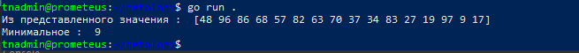

1. Установил Go локально. Но момент тестирования песочницы появлялась ошибка о том, что удаленный сервер не доступен.
2. Изучил примеры.
3. Написал код для перевода метров в футы (1 фут = 0.3048 метр) 

```shell
package main

import "fmt"

func main() {
    fmt.Print("Введите метры: ")
    var input float64
    fmt.Scanf("%f", &input)

    output := input / 0.3048

    fmt.Println("Футов = ", output)
}
```


Код, который найдет наименьший элемент в любом заданном списке
```shell
package main

        import "fmt"

        func main() {
            x := []int{48,96,86,68,57,82,63,70,37,34,83,27,19,97,9,17,}
            current := 0
            fmt.Println ("Из представленного значения : ", x)
            for i, value := range x {
                if (i == 0) {
                   current = value
                } else {
                    if (value < current){
                        current = value
                    }
                }
            }
            fmt.Println("Минимальное : ", current)
        }
```


Код, который выводит числа от 1 до 100, которые делятся на 3
```shell
package main

import "fmt"

func main() {
    end := 0
    for i := 0; i<100; i++ {
        end +=i
        if i % 3 ==0 && i != 0 {
        fmt.Print(i,", ")
        }
     }
}

```


* как сделать так, чтобы числа были через запятую, например? ибо мой метод не совсем корректен, я считаю

4. 

