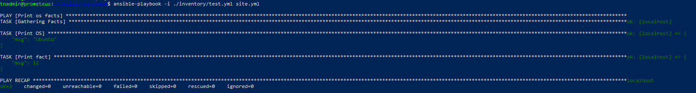
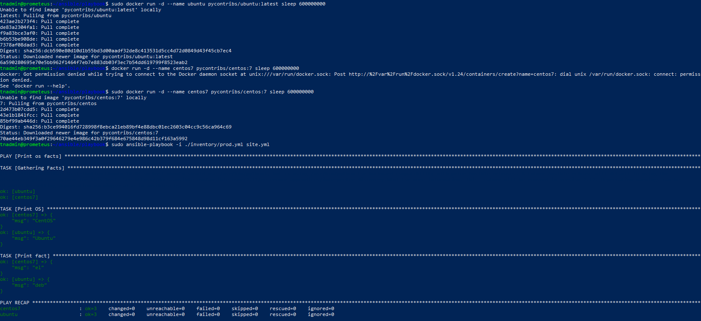

1. Установил ansible 2.10

Создал репозиторий: https://github.com/sakhnail/ansible

Скачал playbook в свой репозиторий

2. Запустил playbook

Заменил <code>some_fact:</code> в group_vars/all/examp.yml <code>some_fact: "all default fact"</code>

Запустил докер-контейнеры и запуск playbook на окружении prod.yml 

Изменил факты в <code>group_vars/deb/examp.yml</code> и <code>group_vars/el/examp.yml</code>
Проверил playbook на prod.yml

Зашифровал факты в group_vars/deb и group_vars/el

Запуск prod с запросом пароля

Вывод ansible-doc

*Наверно нужен "local"

Добавил local в prod

Запустил playbook на окружении prod.yml

